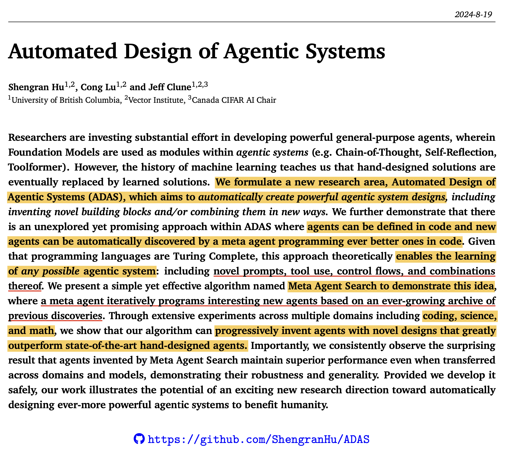

# Automated Design of Agentic Systems

✦ UBC에서 수행된 ADAS(Automated Design of Agentic Systems) 라는 연구는 말 그대로 에이전트를 자동으로 설계하는 프레임워크를 제안한다. 개념적으로 ADAS는 어떤 식으로도 수행될 수 있지만, self evolving 및 evaluation의 용이성을 위해, 이 연구는 "코드"에 기반하여 새로운 에이전트를 발굴하는 Meta Agent Search 라는 구체적인 프레임워크를 구현하여 공개한다. 이 논문에 따르면, Agent 라는 용어가 명확히 정의되지 않았다고 하며, 이 논문에서의 Agent는 Foundation Model을 활용해 "계획", "도구 사용", "결과 도출", "반복"하여 특정 문제 해결하는 일종의 Agentic System이라고 본다.

✦ ADAS는 "사람이 직접 디자인한 알고리즘이 결국에는, AI의 자동화된 구조 발견에의해 대체될 것이다"라는 트렌드에 대한 강한 믿음으로 제안된 새로운 연구 분야로, 과거 사람이 직접 패턴을 작성해서 이미지를 인식하던 기법이 CNN에 의해 대체되었고, 그러한 CNN 또는 신경망의 구조적 패턴 또한 AutoML/NAS에 의해 대체되는 연구 추세에 착안한다. (정확히는 대체된 것은 아니고, 여러 비용적인 측면으로 고려할 부분이 있기는 하지만, 학계에 보고된 가장 우수한 성능의 모델은 이러한 자동화된 기법에 의해 발견된 것임).

✦ 따라서 ADAS의 추상적인 작동 방식도 기존 AutoML과 유사하다. 
- Search Space를 정의하고
- Search Space에서 최적의 에이전트를 찾는 Search Algorithm을 정의하고
- 찾은 에이전트를 평가하는 Evaluation Algorithm을 정의하고
- 이를 반복하여 최적의 에이전트를 찾는 것이다.
- 이 과정에서 발견된 에이전트는 아카이빙되어, 다음 최적의 에이전트를 발견하는 데 활용된다.

✦ 그리고 ADAS를 실증하기 위해 Meta Agent Search(MAS)를 구현하였다. MAS는 위 ADAS 과정을 그대로 따르지만, "코딩"으로 문제를 해결하는 것에 한정된다. 여러가지 이유가 있겠으나, 결과물이 "코드"이기 때문에, 해석과 실제 평가가 용이하기 때문으로 보인다. 구체적인 구현은 Meta Agent로는 GPT-4o를 두고, 결과물의 평가는 GPT-3.5-Turbo로 진행되었으며, Search Space에는 [COT, COT_SC, Reflexion, LLM_debate, Take_a_step_back, QD, Role_Assignment]를 기본적인 FM 모듈로 배치한 다음, 25~50회 정도의 Search Algorithm 을 반복하였다. 

✦ MAS는 총 ARC, [Reading Comprehension(DROP), Math(MGSM), Multi-Task(MMLU), Science(GSM8K)] 4개의 벤치마크에서 대해 실험되었고, 모두 매뉴얼하게 디자인된 COT, COT_SC, Reflexion, LLM_debate, Take_a_step_back, QD, Role_Assignment 각각의 기법이 적용된 에이전트보다 월등히 높은 성능을 보였다. 또한 GPT4o를 통해 발견된 최적의 Agent Top 3개를 Claude Haiku, GPT4, Claude 3.5 Sonnet으로 Foundation 모델을 스위치하여 사용해 보고, 여전히 높은 수준의 성능을 유지하는 것으로 미루어보아, 발견된 Agent의 "전이성/일반화 가능성"도 있다는 것을 확인하였다. 

✦ 개인적인 감상평
- AutoML/NAS 같은 방식은 최적의 모델을 찾아주기는 하지만, 비용이 매우 많이 발생한다. 하지만 ADAS같은 기법은 단순히(?) Foundation Model을 Call 하는 수준이기 때문에, 그리고 가격이 계속해서 빠르게 감소되고 있기 때문에, 부담이 덜한 느낌이다. 리포트 상으로는 한 번의 최적의 에이전트 발견을 위해 약 $500 정도의 비용이 발생했다고 보고하고 있으나, 여러가지 최적화 포인트를 개선한다면 개인적으로는 이 정도까지 들지는 않지 않을까 싶다.

- 매우 간단한 아이디어임에도 불구하고, 코드는 꽤 난잡하게 구현되어 있다. 일종의 프레임워크를 만들어도 좋았겠지만, 특정 벤치마크를 대상으로 Search를 수행하도록 하드코딩 되어 있다는 점이 조금 아쉽다. 코딩 잘하는 누군가가 곧 프레임워크화 해서 내 놓지 않을까 싶다. 

- 한계점도 몇 가지 존재한다. 초기 Search Space를 정의하는 것이 매우 중요한데, 이 논문에서 지정된 것은 모두 사람이 손으로 디자인된 Agent들이 Space 집합에 들어가 있다. 아무리 "자동화" 라는게 미래의 트렌드가 된다고 하더라도, 여전히 "짧은 단계"로 "최적의 결과"를 도출하도록 매뉴얼하게 디자인된 Agent는 계속해서 제안될 것이라고 생각한다. 그럴 수록 ADAS는 자연스럽게 그들의 이점을 취할 수 있게 될것이고. 다만, 최적의 Agent가 과연 "최적"인지를 판단하는 것은 어려운 면이 존재한다고 생각한다. 그러나 발견된 "최적"이라는 것을 사람이 들여다보고, 좀 더 과정을 "압축"해서 좀 더 최적화하는 것도 가능하지 않을까 싶다. 

- 기본적으로 ADAS라는 새로운(?) 연구 분야의 지평선을 여는 연구 중 하나로 볼 수 있으며, 덕분에(?) 이를 토대로 한 다양한 연구가 꽃을 피울 수 있지 않을까 싶다 (바라보는 시각에 따라서는 DSPy 같은것과도 유사점을 일부 공유하는듯 하다).

Link: https://arxiv.org/abs/2408.08435